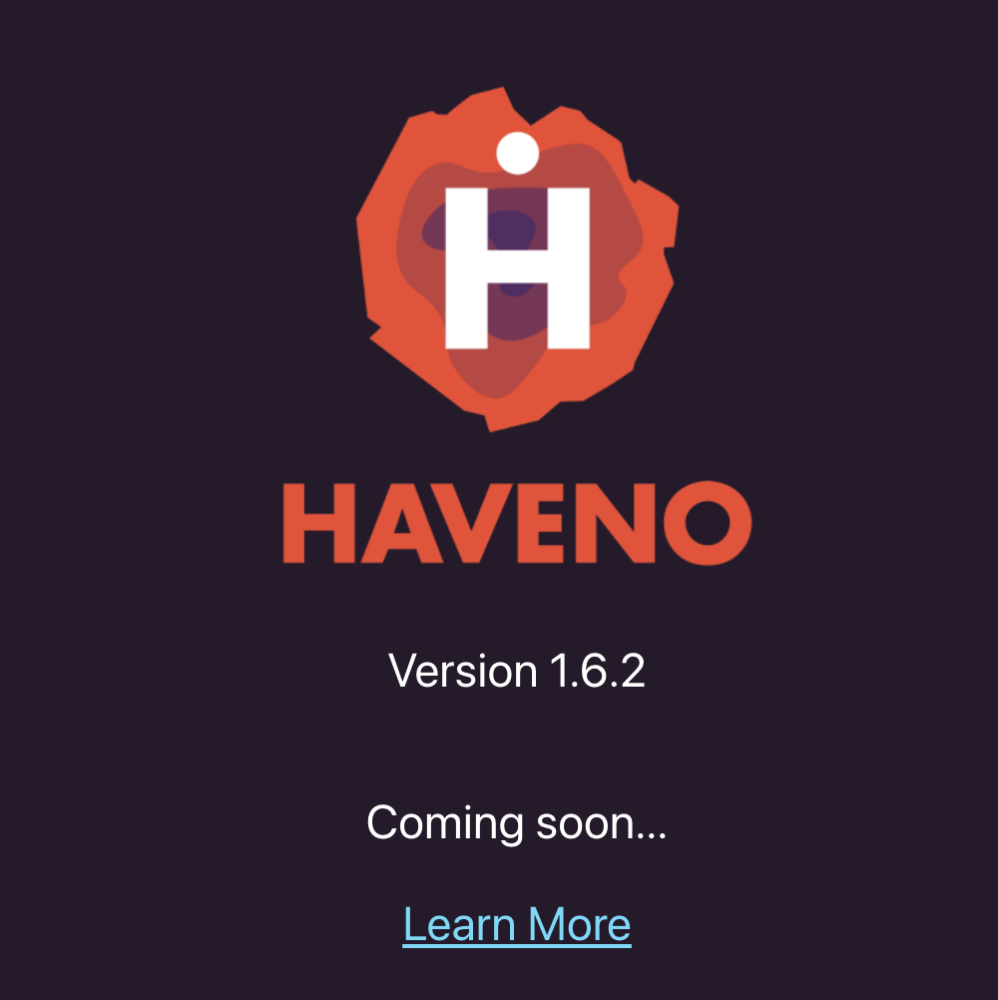

# Haveno UI Proof of Concept

A proof of concept to fetch and render data from Haveno's daemon in ReactJS.

This application is a lightly modified [create-react-app](https://github.com/facebook/create-react-app) with typescript using [envoy proxy](https://www.envoyproxy.io/) and [grpc-web](https://github.com/grpc/grpc-web) to use Haveno's gRPC API.

## Run in a Browser

1. [Run a local Haveno test network](https://github.com/haveno-dex/haveno/blob/master/docs/installing.md), running Alice as a daemon with `make alice-daemon`.
2. `git clone https://github.com/haveno-dex/haveno-ui-poc`
3. In a new terminal, start envoy with the config in haveno-ui-poc/config/envoy.yaml (change absolute path for your system): `docker run --rm --add-host host.docker.internal:host-gateway -it -v ~/git/haveno-ui-poc/config/envoy.yaml:/envoy.yaml -p 8080:8080 envoyproxy/envoy-dev:8a2143613d43d17d1eb35a24b4a4a4c432215606 -c /envoy.yaml`
4. Install protobuf for your system: 
    mac: `brew install protobuf` 
    linux: `apt install protobuf-compiler`
5.  Download `protoc-gen-grpc-web` plugin and make executable as [shown here](https://github.com/grpc/grpc-web#code-generator-plugin)
6. `cd haveno-ui-poc`
7. `npm install`
8. `npm start` to open http://localhost:3000 in a browser
9. Confirm that the Haveno daemon version is displayed (1.6.2)

     

## Run Tests

Running the [top-level API tests](./src/HavenoDaemon.test.tsx) is a great way to develop and test Haveno end-to-end.

[`HavenoDaemon`](./src/HavenoDaemon.ts) provides the interface to the Haveno daemon's gRPC API.

1. [Run a local Haveno test network](https://github.com/haveno-dex/haveno/blob/master/docs/installing.md), running Alice and Bob as daemons with `make alice-daemon` and `make bob-daemon`.
2. `git clone https://github.com/haveno-dex/haveno-ui-poc`
3. In a new terminal, start envoy with the config in haveno-ui-poc/config/envoy.test.yaml (change absolute path for your system): `docker run --rm --add-host host.docker.internal:host-gateway -it -v ~/git/haveno-ui-poc/config/envoy.test.yaml:/envoy.test.yaml -p 8080:8080 -p 8081:8081 envoyproxy/envoy-dev:8a2143613d43d17d1eb35a24b4a4a4c432215606 -c /envoy.test.yaml`
4. In a new terminal, start an instance of monero-wallet-rpc at port 38084. This wallet will be automatically funded in order to fund Alice and Bob during the tests. For example: `cd ~/git/haveno/.localnet/ && ./monero-wallet-rpc --daemon-address http://localhost:38081 --daemon-login superuser:abctesting123 --stagenet --rpc-bind-port 38084 --rpc-login rpc_user:abc123 --wallet-dir ./ --rpc-access-control-origins http://localhost:8080`
5. Install protobuf for your system: 
    mac: `brew install protobuf` 
    linux: `apt install protobuf-compiler`
6. Download `protoc-gen-grpc-web` plugin and make executable as [shown here](https://github.com/grpc/grpc-web#code-generator-plugin)
7. `cd haveno-ui-poc`
8. `npm install`
9. `npm test` to run all tests or `npm run test -- -t 'my test'` to run tests by name.
